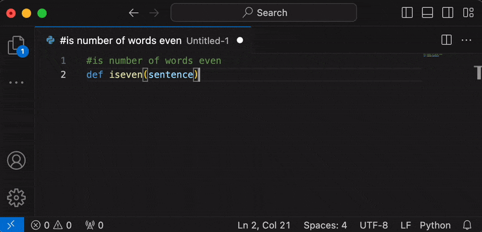

# Ollama Autocoder

A simple to use Ollama autocompletion engine with options exposed and streaming functionality

## Requirements

- Ollama must be serving on the API endpoint applied in settings
  - For installation of Ollama, visit [ollama.ai](https://ollama.ai)
- Ollama must have the `model` applied in settings installed. The current default is `qwen2.5-coder:latest`.
- The `prompt window size` should align with the maximum context window of the model.

## How to Use

1. In a text document, press space *(or any character in the `completion keys` setting)*. The option `Autocomplete with Ollama` or a preview of the first line of autocompletion will appear. Press `enter` to start generation.
   - Alternatively, you can run the `Autocomplete with Ollama` command from the command palette (or set a keybind).
2. After startup, the tokens will be streamed to your cursor.
3. To stop the generation early, press the "Cancel" button on the "Ollama Autocoder" notification or type something.
4. Once generation stops, the notification will disappear.

## Notes

- For fastest results, an Nvidia GPU or Apple Silicon is recommended. CPU still works on small models.
- The prompt only sees behind the cursor. The model is unaware of text in front of its position.
- For CPU-only, low end, or battery powered devices, it is highly recommended to disable the `response preview` option, as it automatically triggers the model. *This will cause `continue inline` to be always on.* You can also increase the `preview delay` time.
- If you don't want inline generation to continue beyond the response preview, change the `continue inline` option in settings to false. *This doesn't apply to the command palette.*
